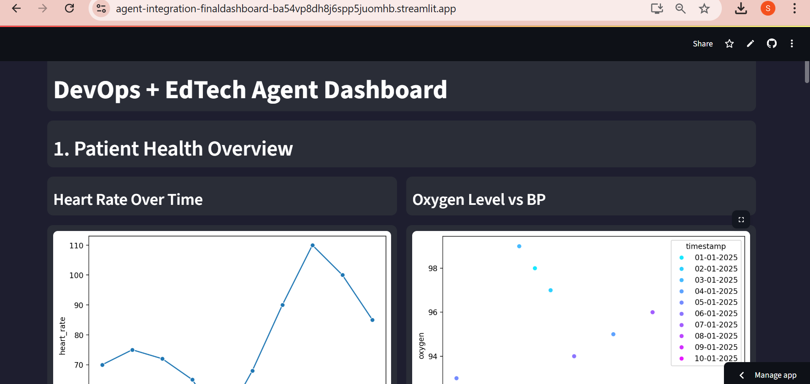

# Agent-Integration-Final_Dashboard
Streamlit dashboard simulating DevOps + EdTech agents (Health, Scores, CI/CD, Uptime, Healing, RL).

A dynamic and intelligent dashboard simulating a real-world DevOps + EdTech environment. This project brings together five autonomous agents that mimic enterprise systems — covering health data, education analytics, CI/CD deployments, uptime monitoring, healing logic, and simulated reinforcement learning.

Crafted using Python and Streamlit, the dashboard is clean, interactive, and beginner-friendly. It helps visualize data-driven automation in action, combining performance monitoring with smart recovery strategies.

---

## 🌐 Live Dashboard
**Experience it live:**  
👉 [https://agent-integration-finaldashboard-ba54vp8dh8j6spp5juomhb.streamlit.app/](https://agent-integration-finaldashboard-ba54vp8dh8j6spp5juomhb.streamlit.app/)

---

## Dashboard Preview



## 💡 What This Project Demonstrates

- 🎯 Intelligent system agents working together on flat-logics (CSV)  
- 📊 Real-time visualization of patient vitals & student scores  
- ⚙️ Simulated DevOps operations (deployments, uptime, error recovery)  
- 🧠 Action selection using a mock RL pattern  
- 🧰 Fully local, deployable & portable via Streamlit  

---

## 🧩 Integrated Modules

1. **🫀 Patient Health Monitoring**  
   - Tracks heart rate, BP, oxygen  
   - Detects abnormal vitals through visualization  

2. **📚 Student Score Analytics**  
   - Subject-wise & time-based performance trends  
   - Simple yet insightful academic progress visuals  

3. **🚀 CI/CD Deployment Logger**  
   - Logs success/failure of simulated deployments  
   - Includes timestamps and latency measures  

4. **📶 Uptime Monitoring**  
   - Plots uptime/downtime across a timeline  
   - Emulates availability tracking of systems  

5. ** Auto-Healing System**  
   - Simulates error detection and recovery actions  
   - Uses retry, rollback, and threshold tuning strategies  

6. ** RL-based Strategy Selector (Mocked)**  
   - Learns from fix history (tabular logic)  
   - Displays most-used & most-successful fixes  

---

##  Tech Stack
- Python 3.7+  
- Streamlit  
- Pandas  
- Seaborn / Matplotlib  
- CSV Logs (no external DB)  

---

## ⚙ Running the Project

1. Clone the repository:
   ```bash
   git clone https://github.com/sanjanagawh9443/Agent-Integration-Final_Dashboard.git


